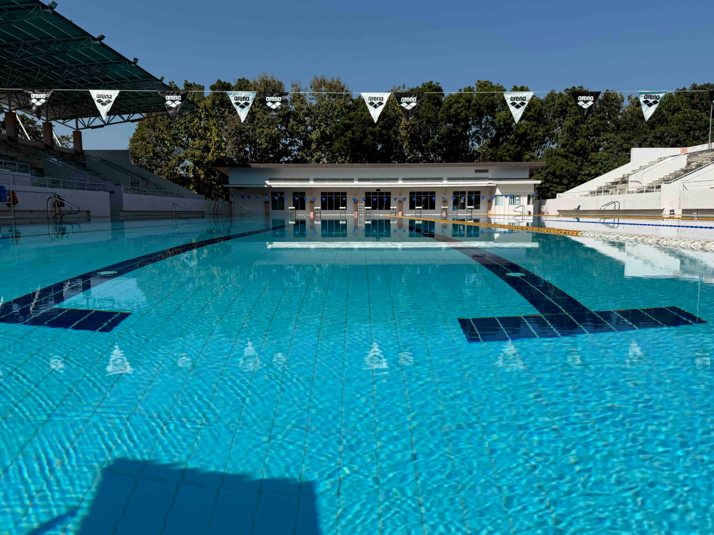

# 20250118_chiangrai

<html>
<head>

<meta charset="UTF-8">
<meta http-equiv="Content-Type" content="text/html; charset=UTF-8">
<meta http-equiv="X-UA-Compatible" content="IE=EmulateIE10" />
<meta http-equiv="X-UA-Compatible" content="IE=edge">

<!--ここから上はお決まりの定型文です-->

<!--ここからが表現の書式などを決めるcssという部分-->

<link href="https://cdnjs.cloudflare.com/ajax/libs/lightbox2/2.7.1/css/lightbox.css" rel="stylesheet">

</head>

<body>

モバイル端末をお使いの場合は、画面を横向きにすると
より見やすくご覧頂けます。

<!--ここ上は、ほぼそのまま使います！-->

<!--QRコードの挿入例-->

 アクセス用QRコード

<marquee direction="left" scrollamount="20" width="30%">(^_^)/~alis</marquee>

<!--流れ文字の挿入例-->
<h1><marquee behavior="left">!!! 2025/01/18、10日ぶりのプール、朝の月は欠けてゆき、夜には満天の星空!!!</marquee></h1>

                          

<!--ここから下が、本体部分-->

<h2>西の空にお月様が沈んでゆきました</h2>

<h2>昨日より少し太陽に近づいて、掛け方は少し大きくなりました</h2>

<h2>東の空は日の出のタイミング、18日朝7:16</h2>

<h2>庭のお花はもうお目覚め</h2>

<h2>寒い日が続いてプールは10日ぶり 入口のお花が熱帯の陽射しで輝きました</h2>

<h2>一番輝いてる一輪をアップでパチリ！</h2>

<h2>プールは管理状態が非常に良いです</h2>

<h2>この日の空は雲ひとつない快晴</h2>

<h2> プールの水は綺麗で、50m先まではっきり見える透明度 I-Phoneで水中撮影</h2>

<h2>水中照明が切れたらしく、メンテ中でした</h2>

<h2>水中映像はこんな感じ、 街のプールだったらこの状態では放置しないですかね〜 大学のプールならではかも・・・</h2>

<h2>プール帰りにすれ違ったパトカー 回転灯がLEDで小型化しててカッコいいですね 空力も良さそう</h2>

<iframe width="560" height="315" src="https://www.youtube.com/embed/vy_ZneVJFSc?si=ibT-y4QpC1LQHaiz" title="YouTube video player" frameborder="0" allow="accelerometer; autoplay; clipboard-write; encrypted-media; gyroscope; picture-in-picture; web-share" referrerpolicy="strict-origin-when-cross-origin" allowfullscreen></iframe> 

<h2>今日の夕焼けグラデーションはオレンジ色でした</h2>

<h2>5分後はこんな感じで宵の明星「金星」が輝きました</h2>

<h2>日本では九州南部以南でないと見えない エリダヌス座のα星「アケルナル」が屋根の上で輝きます</h2>

<h2>エリダヌス座はちょっとマニアックなので説明リンク貼ります</h2>
<h1><a href="https://stellaroom.com/constellation/eri.html" target="_blank">エリダヌス座の説明</a></h1>

   
<h2>以上、今回も朝一の東の空に沈みゆく月から夜の賑やかな星空でした。 日中は10日ぶりのプール映像で一部i-Phoneによる水中撮影に挑戦してみました。 ここまで観ていただきありがとうございました。</h2>

     
<h2>
<a href="https://torokoid.github.io/20241126_chiangrai/" target="_blank">Back to the menu page</a>
</h2>

   

         

  

      

<!--本体はここまで-->

<!--画面に空白地帯を作って、背景が見えるようにしています-->
                                              

<!-- フッタ -->
<footer>

Copyright 2025/01/19 alis @ChiangRai

</footer>

<!--HPにさまざまなJavaScriptを呼び込むための書式-->

